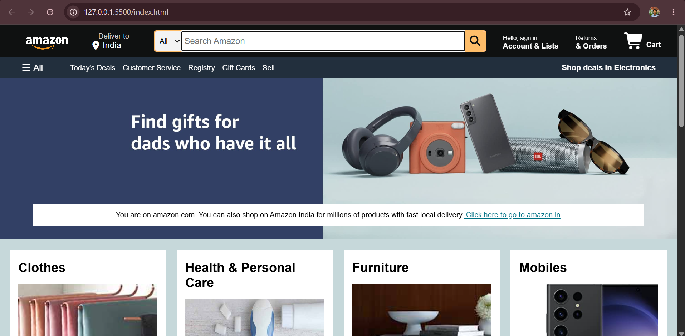

# Amazon Clone

🌐 **Live Demo:** https://mashood-git.github.io/amazon-clone/

📂 **Repository:** https://github.com/Mashood-git/amazon-clone

A frontend clone of the Amazon homepage built using **HTML**, **CSS**, and **JavaScript**. This project was created to practice responsive web design, Flexbox, and basic JavaScript DOM manipulation.

## 📸 Preview



> Replace `screenshot.png` with a screenshot of your project after you upload one.

---

## ✨ Features

- Amazon-inspired navigation bar
- Responsive search bar
- Hero banner
- Product cards
- Footer section
- JavaScript search functionality
- Clean and organized code

---

## 🛠️ Technologies Used

- HTML5
- CSS3
- JavaScript
- Font Awesome

---

## 📂 Project Structure

```
amazon-clone/
│── index.html
│── style.css
│── script.js
│── amazon_logo.png
│── hero_image.jpg
│── box1_image.jpg
│── box2_image.jpg
│── box3_image.jpg
│── box4_image.jpg
│── box5_image.jpg
│── box6_image.jpg
│── box7_image.jpg
│── box8_image.jpg
└── README.md
```

---

## 🚀 Getting Started

1. Clone the repository

```bash
git clone https://github.com/Mashood-git/amazon-clone.git
```

2. Open the project folder.

3. Open `index.html` in your browser.

---

## 📚 What I Learned

- HTML page structure
- CSS Flexbox
- Responsive layouts
- JavaScript DOM Manipulation
- Event Listeners
- Git & GitHub basics

---

## 🔮 Future Improvements

- Add a shopping cart
- Product search and filtering
- User login page
- Wishlist
- Local Storage support
- Responsive mobile design
- Backend integration using Node.js and MongoDB

---

## 👨‍💻 Author

**Mashood Ahmed Shariff**

GitHub: https://github.com/Mashood-git